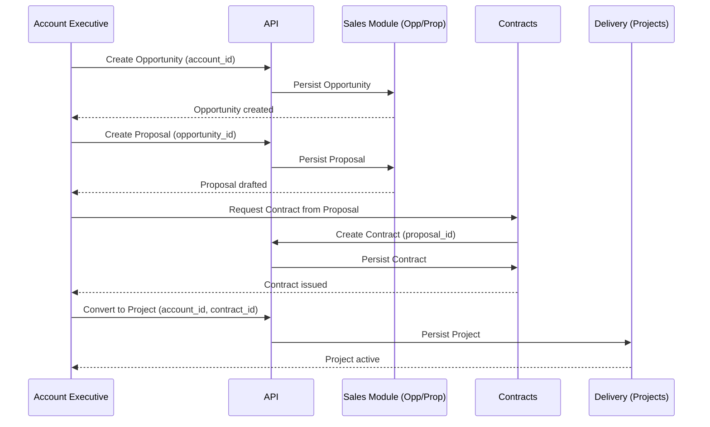
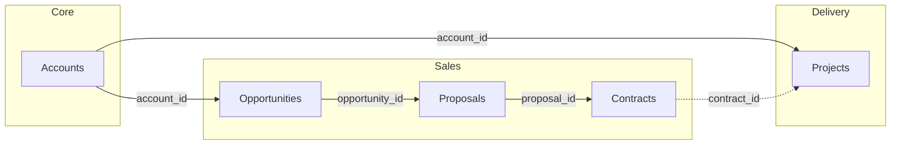

# Contract Module - Comprehensive Documentation

## Table of Contents
1. [Overview](#overview)
2. [Module Flow & Architecture](#module-flow--architecture)
3. [Inter-Module Relationships](#inter-module-relationships)
4. [Contract Lifecycle & Workflow](#contract-lifecycle--workflow)
5. [Data Model & Fields](#data-model--fields)
6. [Status & Risk Management](#status--risk-management)
7. [Integration Points](#integration-points)
8. [UI Structure & Tabs](#ui-structure--tabs)
9. [API Endpoints](#api-endpoints)
10. [Business Rules](#business-rules)

---

## Overview

The Contract Management module is a critical component in the sales-to-delivery pipeline, positioned between **Proposals** and **Projects**. It manages the complete contract lifecycle from creation through execution, renewal, and archival.

### Key Business Value
- **Legal Protection**: Ensures contracts meet organizational standards and reduce legal risks
- **Revenue Security**: Signed contracts guarantee revenue and define payment terms
- **Scope Management**: Contracts define deliverables and prevent scope creep
- **Compliance**: Automated compliance checking and regulatory alignment
- **AI-Powered Analysis**: Intelligent risk assessment and clause identification

### Position in Business Flow
```
Account → Opportunity → Proposal → Contract → Project → Finance
         ✅            ⚠️         ✅         ❌      ✅
```

---

## Module Flow & Architecture

### High-Level Flow Diagram



### Contract Creation Flow

1. **Trigger**: Client acceptance of proposal terms
2. **Source**: Proposal data (opportunity_id, account_id, terms, pricing)
3. **Process**:
   - Upload contract document (PDF/DOCX)
   - AI analysis triggers automatically
   - Extract key terms (dates, value, parties)
   - Risk assessment and clause identification
   - Assign to legal reviewer
4. **Output**: Contract record with status, risk level, and assigned reviewer

### Contract Execution Flow

1. **Legal Review**: Attorney reviews high-risk items
2. **Exception Approval**: Management approves proposed exceptions
3. **Client Negotiation**: Submit exceptions and negotiate terms
4. **Final Approval**: All parties approve
5. **Execution**: Digital signatures and contract execution
6. **Project Creation**: Trigger project creation from executed contract

---

## Inter-Module Relationships

### Module Dependency Graph



### Field-Level Dependencies

#### Contracts → Proposals
- **Field**: `proposal_id` (UUID)
- **Relationship**: One Proposal can generate multiple Contract versions
- **Usage**: Pre-populate contract terms from proposal

#### Contracts → Opportunities
- **Field**: `opportunity_id` (UUID) - via Proposal
- **Relationship**: Indirect through Proposal
- **Usage**: Track contract origin in sales pipeline

#### Contracts → Accounts
- **Field**: `account_id` (UUID)
- **Relationship**: Direct - Contract belongs to Account
- **Usage**: Client relationship management, contract portfolio view

#### Contracts → Projects
- **Field**: `contract_id` (UUID) in Projects table
- **Relationship**: One Contract can govern one or more Projects
- **Usage**: Project initiation trigger, scope definition, billing terms

### Data Flow Between Modules

#### From Proposal to Contract
```typescript
interface ProposalToContractMapping {
  proposal_id: string;           // Direct link
  opportunity_id: string;        // Via proposal
  account_id: string;            // Via proposal/opportunity
  contract_value: number;        // From proposal pricing
  start_date: Date;              // From proposal timeline
  end_date: Date;                // From proposal timeline
  deliverables: string[];        // From proposal scope
  payment_terms: string;         // From proposal terms
}
```

#### From Contract to Project
```typescript
interface ContractToProjectMapping {
  contract_id: string;           // Direct link
  account_id: string;            // Via contract
  project_name: string;          // From contract project_name
  budget: number;                // From contract_value
  start_date: Date;              // From contract start_date
  end_date: Date;                // From contract end_date
  deliverables: Deliverable[];  // From contract deliverables
  billing_schedule: Schedule;    // From contract payment_terms
}
```

---

## Contract Lifecycle & Workflow

### Workflow Stages

The contract workflow consists of 5 main stages:

#### 1. Document Upload
- **Status**: `awaiting-review`
- **Actions**:
  - Upload contract document (PDF/DOCX)
  - AI analysis triggers automatically
  - Extract key terms and clauses
  - Auto-populate contract fields
- **Duration**: Immediate (AI processing)
- **Next**: Initial AI Review

#### 2. Initial AI Review
- **Status**: `awaiting-review` → `in-legal-review`
- **Actions**:
  - Risk assessment and clause identification
  - Categorize clauses (Red/Amber/Green)
  - Generate executive summary
  - Flag high-risk items
- **Duration**: Minutes (automated)
- **Next**: Legal Review (if high risk) or Exception Approval

#### 3. Legal Review
- **Status**: `in-legal-review`
- **Actions**:
  - Attorney reviews high-risk items
  - Review AI analysis and recommendations
  - Approve or request exceptions
  - Assign reviewer if not auto-assigned
- **Duration**: 1-3 days
- **Next**: Exception Approval

#### 4. Exception Approval
- **Status**: `exceptions-approved`
- **Actions**:
  - Management reviews proposed exceptions
  - Approve exceptions or request renegotiation
  - Document approval decisions
- **Duration**: 1-2 days
- **Next**: Client Negotiation or Execution

#### 5. Client Negotiation
- **Status**: `negotiating`
- **Actions**:
  - Submit exceptions to client
  - Negotiate terms and conditions
  - Track negotiation history
  - Update contract version
- **Duration**: 2-6 weeks
- **Next**: Execution or Back to Legal Review

#### 6. Execution
- **Status**: `executed`
- **Actions**:
  - Final contract approval
  - Digital signatures
  - Contract execution
  - Trigger project creation
- **Duration**: 1-2 days
- **Next**: Project Initiation

### Workflow State Machine

```
awaiting-review
    ↓
[AI Analysis]
    ↓
in-legal-review
    ↓
[Legal Review]
    ↓
exceptions-approved
    ↓
[Management Approval]
    ↓
negotiating (optional)
    ↓
[Client Negotiation]
    ↓
executed
    ↓
[Project Creation]
```

---

## Data Model & Fields

### Contract Entity

```typescript
interface Contract {
  // Identifiers
  id: string;                    // UUID
  contract_id: string;            // Human-readable ID (e.g., "CTR-2024-001")
  contract_number?: string;       // External contract number
  
  // Relationships
  proposal_id?: string;           // FK to Proposals
  opportunity_id?: string;        // FK to Opportunities (via Proposal)
  account_id: string;             // FK to Accounts
  project_id?: string;            // FK to Projects (after execution)
  
  // Basic Information
  client_name: string;            // From Account
  project_name: string;           // Project/Engagement name
  document_type: string;         // "Professional Services Agreement", "Construction Contract", etc.
  version: string;                // "v1.0", "v2.1", etc.
  
  // Financial
  contract_value?: number;       // Total contract value
  currency?: string;              // "USD", "EUR", etc.
  payment_terms?: string;         // "NET 30", "50% upfront", etc.
  
  // Dates
  start_date?: Date;              // Contract start date
  end_date?: Date;                // Contract end date
  upload_date: Date;              // When contract was uploaded
  execution_date?: Date;          // When contract was executed
  renewal_date?: Date;            // Next renewal date
  
  // Status & Risk
  status: ContractStatus;         // See Status section
  risk_level: RiskLevel;          // "low" | "medium" | "high"
  execution_status?: string;      // "not_started" | "in_progress" | "completed"
  
  // AI Analysis Results
  red_clauses: number;            // High-risk clauses count
  amber_clauses: number;          // Medium-risk clauses count
  green_clauses: number;          // Low-risk clauses count
  total_clauses: number;          // Total clauses analyzed
  
  // Review & Assignment
  assigned_reviewer?: string;      // Legal reviewer name/ID
  review_status?: string;         // Review progress
  last_modified: Date;            // Last update timestamp
  
  // Document
  file_name?: string;             // Original file name
  file_size?: string;             // File size (e.g., "2.4 MB")
  file_url?: string;              // Storage URL
  
  // Metadata
  terms_and_conditions?: string;  // Full terms text
  metadata?: Record<string, any>; // Additional JSON data
  created_by?: string;             // User ID
  created_at: Date;
  updated_at: Date;
}
```

### Contract Status Enum

```typescript
type ContractStatus =
  | "awaiting-review"      // Just uploaded, AI analysis pending
  | "in-legal-review"       // Under legal review
  | "exceptions-approved"  // Exceptions approved by management
  | "negotiating"           // In client negotiation
  | "executed"              // Contract signed and active
  | "archived";            // Archived/expired
```

### Risk Level Enum

```typescript
type RiskLevel = "low" | "medium" | "high";
```

### Clause Analysis Model

```typescript
interface ContractAnalysis {
  clauseTitle: string;            // Clause name/title
  detectedText: string;           // Extracted clause text
  riskLevel: "green" | "amber" | "red";
  suggestedReplacement?: string;  // AI-suggested alternative
  reasoning: string;              // Why this risk level
  location: string;               // Page/section reference
  category?: string;              // "Risk Management", "Financial", "IP", etc.
}
```

### Clause Library Model

```typescript
interface ClauseLibraryItem {
  id: string;
  title: string;                 // Clause name
  category: string;               // "Risk Management", "Financial", "IP", "Termination", etc.
  clauseText: string;             // Preferred clause text
  acceptableAlternatives: string[]; // Acceptable variations
  fallbackPositions: string[];    // Fallback options
  riskLevel: "preferred" | "acceptable" | "fallback";
}
```

---

## Status & Risk Management

### Status Definitions

#### `awaiting-review`
- **Description**: Contract uploaded, awaiting initial AI analysis
- **Actions Available**: View, Edit, Delete
- **Next States**: `in-legal-review` (after AI analysis)

#### `in-legal-review`
- **Description**: Under review by legal team
- **Actions Available**: View, Assign Reviewer, Add Comments
- **Next States**: `exceptions-approved`, `negotiating`, or back to `awaiting-review`

#### `exceptions-approved`
- **Description**: Management has approved proposed exceptions
- **Actions Available**: View, Submit to Client, Execute
- **Next States**: `negotiating` or `executed`

#### `negotiating`
- **Description**: In active negotiation with client
- **Actions Available**: View, Update Version, Add Negotiation Notes
- **Next States**: `executed`, `in-legal-review` (if renegotiation needed)

#### `executed`
- **Description**: Contract signed and active
- **Actions Available**: View, Create Project, Archive, Renew
- **Next States**: `archived` (on expiration)

#### `archived`
- **Description**: Contract expired or archived
- **Actions Available**: View (read-only), Restore
- **Next States**: None (terminal state)

### Risk Level Calculation

Risk level is determined by AI analysis based on:

1. **Red Clauses Count**: High-risk clauses that conflict with company policy
2. **Amber Clauses Count**: Medium-risk clauses that may be acceptable
3. **Total Clauses**: Overall contract complexity

**Risk Level Logic**:
- **High**: Red clauses > 5 OR (Red clauses > 2 AND Red% > 15%)
- **Medium**: Red clauses 1-5 OR Amber clauses > 10
- **Low**: Red clauses = 0 AND Amber clauses < 10

### Risk Categories

#### Red (High Risk)
- Non-negotiable clauses that conflict with company policy
- Unlimited liability clauses
- Unfavorable indemnification terms
- Intellectual property assignment issues
- Termination penalties

#### Amber (Medium Risk)
- Not ideal but may be acceptable
- Negotiable terms
- Standard industry variations
- Acceptable with management approval

#### Green (Low Risk)
- Standard, acceptable clauses
- Aligned with company policy
- Preferred language
- No action required

---

## Integration Points

### 1. Proposal Module Integration

**Trigger**: When Proposal status changes to "Won" or "Accepted"

**Data Flow**:
```typescript
// Auto-create contract from proposal
POST /api/contracts/from-proposal
{
  proposal_id: string;
  auto_analyze: boolean;  // Trigger AI analysis
}
```

**Pre-populated Fields**:
- `account_id` from Proposal
- `opportunity_id` from Proposal
- `contract_value` from Proposal pricing
- `start_date`, `end_date` from Proposal timeline
- `deliverables` from Proposal scope
- `payment_terms` from Proposal terms

### 2. Project Module Integration

**Trigger**: When Contract status changes to "executed"

**Data Flow**:
```typescript
// Auto-create project from executed contract
POST /api/projects/from-contract
{
  contract_id: string;
  project_manager_id?: string;
}
```

**Pre-populated Fields**:
- `account_id` from Contract
- `contract_id` from Contract
- `project_name` from Contract
- `budget` from Contract value
- `start_date`, `end_date` from Contract
- `deliverables` from Contract

### 3. Account Module Integration

**Display**: Contract portfolio view in Account detail page

**Data Flow**:
```typescript
// Get all contracts for an account
GET /api/contracts?account_id={account_id}
```

**Usage**:
- Show contract history in Account detail
- Calculate total contract value per account
- Track contract renewal dates
- Monitor account contract compliance

### 4. Opportunity Module Integration

**Display**: Contract status in Opportunity pipeline

**Data Flow**:
```typescript
// Get contract for opportunity (via proposal)
GET /api/contracts?opportunity_id={opportunity_id}
```

**Usage**:
- Show contract status in Opportunity detail
- Track contract creation from won opportunities
- Link contracts to sales pipeline

### 5. Finance Module Integration

**Trigger**: Contract execution and payment terms

**Data Flow**:
```typescript
// Create billing schedule from contract
POST /api/finance/billing-schedule
{
  contract_id: string;
  payment_terms: string;
  contract_value: number;
}
```

**Usage**:
- Generate invoices based on contract payment terms
- Track contract revenue recognition
- Monitor payment schedules

---

## UI Structure & Tabs

### Main Contract Management Page

The Contract Management page uses a tabbed interface with 5 main tabs:

#### 1. Dashboard Tab
**Purpose**: Overview and analytics

**Components**:
- **AI Predictive Alerts**: 
  - Contract expirations (30/60/90 days)
  - Overdue reviews
  - Renewal opportunities
- **Key Metrics Cards**:
  - Total Active Contracts
  - High-Risk Contracts
  - Pending Reviews
  - Completed This Month
- **Recent Activity Feed**: Latest contract updates
- **Risk Distribution Chart**: Visual breakdown of risk levels
- **AI Trend Analysis**: Predictive insights

#### 2. Contracts Tab
**Purpose**: Contract repository and management

**Components**:
- **Upload Section**: Drag & drop file upload with AI features
- **Search & Filters**:
  - AI-powered natural language search
  - Filter by status, risk level, account
  - Quick action buttons (High Risk, Pending Reviews, Archived)
- **Contract Table**:
  - Columns: Contract ID, Client/Project, Status, Risk, Reviewer, Last Modified
  - Actions: View, Edit, Archive
  - Sortable and paginated

#### 3. AI Analysis Tab
**Purpose**: Detailed contract analysis and insights

**Components**:
- **Contract Selector**: Choose contract to analyze
- **Contract Summary**: Overview with risk breakdown
- **Detailed Clause Analysis**:
  - Red/Amber/Green clause listing
  - Clause details with reasoning
  - Suggested replacements
- **AI Executive Summary**:
  - Contract overview
  - Key financial terms
  - Critical action items
  - AI recommendations

#### 4. Clause Library Tab
**Purpose**: Manage preferred clauses and alternatives

**Components**:
- **Clause Categories**: Risk Management, Financial, IP, Termination, etc.
- **Clause Cards**:
  - Preferred language
  - Acceptable alternatives
  - Fallback positions
  - Risk level indicator
- **AI Features**:
  - Alternative wording generation
  - Learning from successful negotiations
- **Search & Filter**: Find clauses by category or keyword

#### 5. Workflow Tab
**Purpose**: Configure and monitor contract workflow

**Components**:
- **Workflow Steps Visualization**:
  1. Document Upload
  2. Initial AI Review
  3. Legal Review
  4. Exception Approval
  5. Client Negotiation
- **Role Assignments**: Legal reviewers and approval authority
- **AI Automation Rules**:
  - Auto reviewer assignment
  - Escalation rules
  - Workflow optimization suggestions
- **Status Tracking**: Current stage for each contract

---

## API Endpoints

### Contract CRUD Operations

#### List Contracts
```http
GET /api/contracts
Query Parameters:
  - status?: ContractStatus
  - risk_level?: RiskLevel
  - account?: string (account_id or name)
  - search?: string (search query)
  - page?: number
  - limit?: number

Response:
{
  success: true,
  data: Contract[],
  count: number,
  page: number,
  limit: number
}
```

#### Get Contract by ID
```http
GET /api/contracts/:id

Response:
{
  success: true,
  data: Contract
}
```

#### Create Contract
```http
POST /api/contracts
Body:
{
  proposal_id?: string;
  account_id: string;
  project_name: string;
  document_type: string;
  contract_value?: number;
  start_date?: Date;
  end_date?: Date;
  file?: File;  // Multipart form data
}

Response:
{
  success: true,
  data: Contract
}
```

#### Update Contract
```http
PUT /api/contracts/:id
Body:
{
  status?: ContractStatus;
  risk_level?: RiskLevel;
  assigned_reviewer?: string;
  contract_value?: number;
  start_date?: Date;
  end_date?: Date;
  // ... other updatable fields
}

Response:
{
  success: true,
  data: Contract
}
```

#### Archive Contract
```http
DELETE /api/contracts/:id
// Soft delete - sets status to "archived"

Response:
{
  success: true,
  message: "Contract archived"
}
```

### Contract Analysis Endpoints

#### Trigger AI Analysis
```http
POST /api/contracts/:id/analyze

Response:
{
  success: true,
  data: {
    red_clauses: number,
    amber_clauses: number,
    green_clauses: number,
    total_clauses: number,
    risk_level: RiskLevel,
    analysis: ContractAnalysis[]
  }
}
```

#### Get Contract Analysis
```http
GET /api/contracts/:id/analysis

Response:
{
  success: true,
  data: ContractAnalysis[]
}
```

### Integration Endpoints

#### Create Contract from Proposal
```http
POST /api/contracts/from-proposal
Body:
{
  proposal_id: string;
  auto_analyze?: boolean;
}

Response:
{
  success: true,
  data: Contract
}
```

#### Create Project from Contract
```http
POST /api/projects/from-contract
Body:
{
  contract_id: string;
  project_manager_id?: string;
}

Response:
{
  success: true,
  data: Project
}
```

---

## Business Rules

### Contract Creation Rules

1. **From Proposal**:
   - Contract can only be created from "Won" or "Accepted" proposals
   - Proposal must have approved pricing and terms
   - Contract inherits account_id, opportunity_id from Proposal

2. **Manual Creation**:
   - Must specify account_id
   - Contract value > $100K requires legal review
   - All contracts require AI analysis before execution

### Status Transition Rules

1. **awaiting-review → in-legal-review**:
   - Automatic after AI analysis completes
   - Can be manually triggered

2. **in-legal-review → exceptions-approved**:
   - Requires assigned reviewer approval
   - All high-risk items must be addressed

3. **exceptions-approved → negotiating**:
   - Optional - can go directly to executed if no exceptions
   - Requires management approval

4. **negotiating → executed**:
   - Requires all parties to sign
   - Contract value must match approved proposal (if from proposal)

5. **executed → archived**:
   - Automatic on contract expiration
   - Can be manually archived

### Risk Management Rules

1. **High-Risk Contracts**:
   - Must be reviewed by legal team
   - Cannot be executed without management approval
   - Require exception documentation

2. **Risk Level Calculation**:
   - Updated automatically after AI analysis
   - Can be manually overridden by legal reviewer

3. **Clause Analysis**:
   - Red clauses must be addressed before execution
   - Amber clauses require review and approval
   - Green clauses are automatically accepted

### Integration Rules

1. **Proposal → Contract**:
   - One Proposal can generate multiple Contract versions
   - Contract value cannot exceed Proposal value by >10% without approval

2. **Contract → Project**:
   - Only executed contracts can create projects
   - Project budget inherits from contract value
   - Project timeline inherits from contract dates

3. **Account → Contracts**:
   - All contracts must be linked to an account
   - Account health score considers contract compliance

### Compliance Rules

1. **Legal Review Requirements**:
   - Contracts > $100K require legal review
   - High-risk contracts require legal review
   - Standard contracts can be auto-approved if low risk

2. **Approval Workflows**:
   - Contract value > $250K requires VP approval
   - Discounts > 15% require sales manager approval
   - Non-standard terms require legal counsel approval

3. **Documentation Requirements**:
   - All contracts must have uploaded document
   - Contract amendments must be documented
   - Approval decisions must be recorded

---

## Implementation Notes

### Current Implementation Status

#### ✅ Completed
- Contract Management page with 5 tabs (Dashboard, Contracts, AI Analysis, Clause Library, Workflow)
- Contract listing with search and filters
- Contract detail view
- Contract create/edit forms
- Basic API integration structure
- Theme styling aligned with megapolis_fe

#### ⚠️ Partially Implemented
- AI analysis (UI ready, backend integration pending)
- Clause library (UI ready, management features pending)
- Workflow automation (UI ready, rules engine pending)
- File upload (UI ready, storage integration pending)

#### ❌ Not Yet Implemented
- Backend API endpoints
- AI analysis service integration
- Document storage (S3/cloud storage)
- Digital signature integration
- Automated notifications
- Contract renewal management
- Amendment tracking

### Next Steps

1. **Backend API Development**:
   - Implement contract CRUD endpoints
   - Add AI analysis integration
   - Set up document storage

2. **Integration**:
   - Connect with Proposal module
   - Connect with Project module
   - Connect with Account module

3. **Enhancements**:
   - Real-time notifications
   - Advanced analytics
   - Workflow automation rules
   - Clause library management

---

## References

- [Inter-Module Dependencies](./mystic-heaven/docs/data/inter-module-dependencies.md)
- [Business Workflows](./mystic-heaven/docs/workflows/BUSINESS_WORKFLOWS.md)
- [Module Overview](./mystic-heaven/docs/modules/MODULE_OVERVIEW.md)
- [Requirements Document](./mystic-heaven/REQUIREMENTS_DOCUMENT.md)
- [Backend Development Map](./mystic-heaven/BACKEND_DEVELOPMENT_MAP.md)

